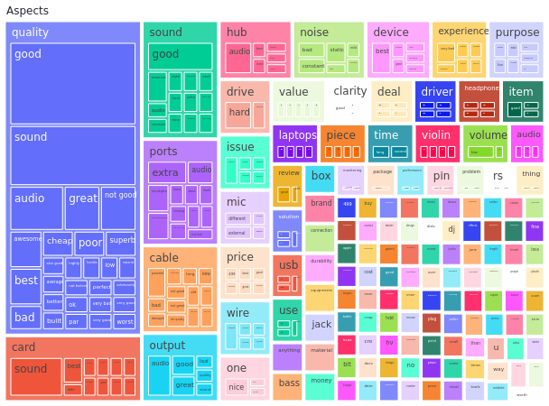

# Actionble Insights From Reviews

Key to building a successfull product is understanding what users want and what users don't want.

This insight can be useful in serveral ways.
1. Designing product that users actually want.
2. Fixing defects in product or addressing users pain points.
3. Staying ahead of the competition.

There are millions of reviews that people leave on sites like amazon, tripadvisor etc. To gain insights from this data, you could either read all the reviews one by one or let machine analyze these reviews and find main topics that user care about.

# Demo

Acceess [Interactive POC](https://huggingface.co/spaces/breathingcyborg/reviews-actionable-insights) build using streamlit, you can either chose one of csv provided or upload your own.

